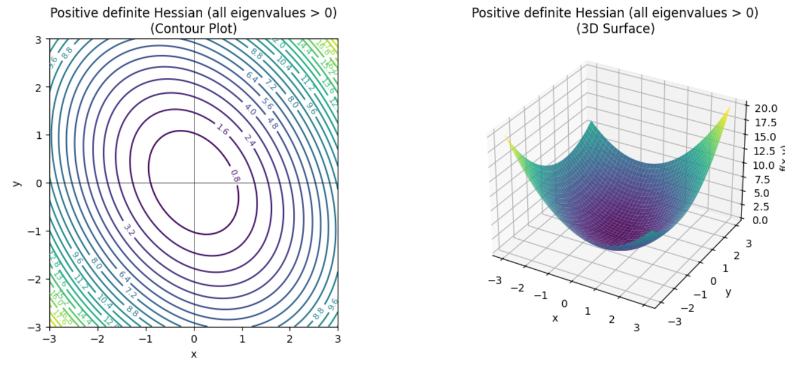
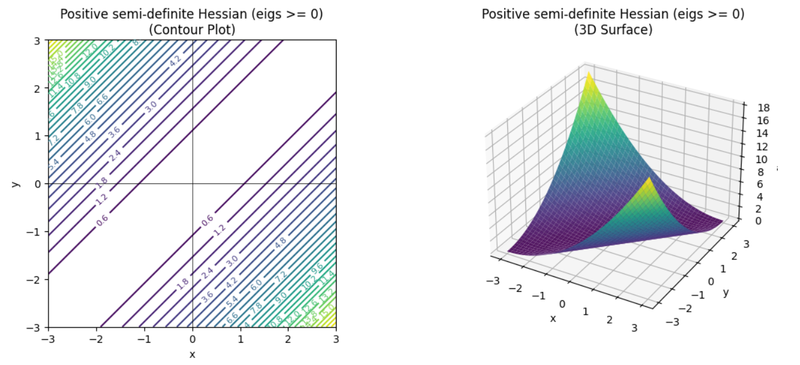
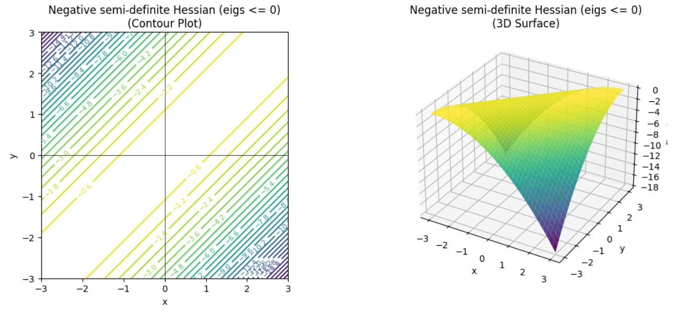
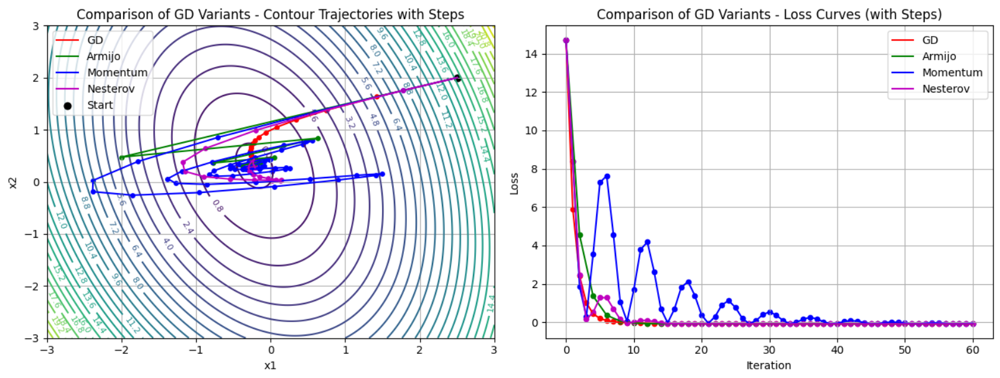
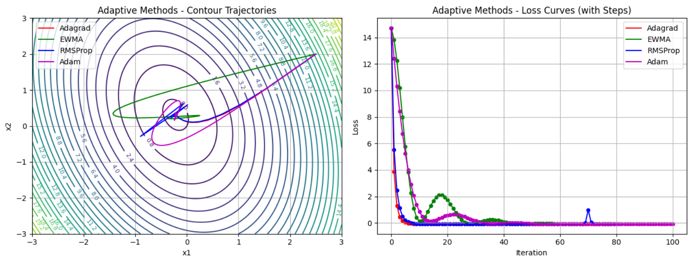

# Optimization Techniques for Data Science — Project

This repository contains my **individual assignment** for the course **Optimization Techniques for Data Science** at **IIIT Kottayam**.  
The project implements and visualizes a wide range of classical and modern optimization algorithms, including contour plots, 3D surfaces, and convergence curves.

All code is written in **Python (Jupyter Notebook)** with detailed explanations and comments.

---

## Contents

### **1. Types of Hessians**
- Positive definite  
- Positive semi-definite  
- Negative definite  
- Negative semi-definite  
- Indefinite  
- Includes **3D surface plots + contour plots**.

---

### **2. Gradient Descent Variants**
- Standard Gradient Descent  
- Armijo Backtracking  
- Momentum GD  
- Nesterov Accelerated GD  
- Each method includes **trajectory visualization over contours + loss curves**.

---

### **3. Linear Regression Optimization**
- Batch Gradient Descent  
- Stochastic Gradient Descent  
- Regression line visualization  
- Parameter contour + loss curve comparison

---

### **4. Logistic Regression**
- Gradient descent training  
- Log-loss convergence  
- **Decision boundary + trajectory + contours**

---

### **5. Adaptive Optimization Algorithms**
- Adagrad  
- RMSProp  
- EWMA (Exponential Weighted Moving Average)  
- Adam  
- Includes **loss curves and contour trajectories**.

---

### **6. Subgradient Methods**
- Lasso (L1) using subgradient descent  
- Ridge (L2) using gradient descent  
- Convergence curves + contour-based interpretation

---

### **7. Newton’s Method**
- Root finding using Newton–Raphson  
- Multivariate optimization  
- Quadratic one-step convergence demonstration  
- **Contour and loss visualizations**

---

### **8. Secant Method**
- Root finding without derivatives  
- Visualization of iteration steps on function graph

---

### **9. BFGS Quasi-Newton Method**
- Basic BFGS implementation with backtracking  
- Parameter trajectory + loss convergence  
- Contour plots included

---

### **10. Constrained Optimization (Single Constraint)**
- Lagrange multipliers  
- Symbolic solution using SymPy  
- **Constraint line + contour + optimal point**

---

### **11. Constrained Optimization (Two Constraints)**
- Lagrange multipliers with two equality constraints  
- 3D plot of feasible set intersection  
- Optimal point identification

---

## Sample images

Below are some sample images of the project:

### Types of Hessian

<p align="center">
  
  
  
  
  
</p>


### GD Variants Comparison



### Advanced Optimization Algorithms



### Newton’s Method Resultant contour


---

##  Files Included
- `IMA314_Project.ipynb` — Main notebook
- `requirements.txt` - Set of requirements to be installed
- Support images generated during execution (optional)

---

## Requirements

Install required packages:

-numpy
-matplotlib
-scikit-learn
-sympy
-scipy

---

## Installation:

```bash
pip install -r requirements.txt
```
---

## How to Run

```bash
git clone https://github.com/Abhinav-Marlingaplar/Optimisation-Algorithms-for-Data-Science.git
cd Optimisation-Algorithms-for-Data-Science
jupyter notebook IMA314_Project.ipynb
```
---


## Author

- Abhinav Marlingaplar
- B.Tech CSE (AI & DS)
- Indian Institute of Information Technology, Kottayam
